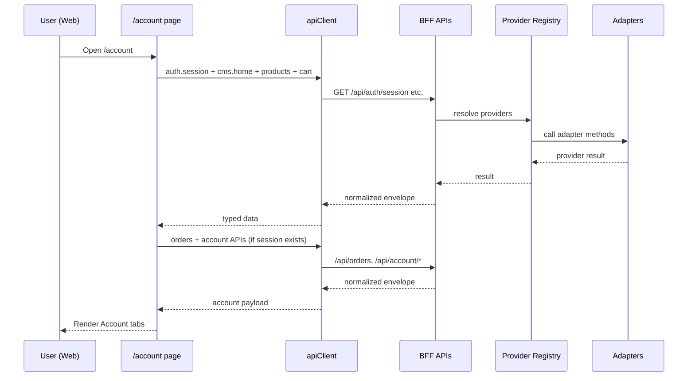
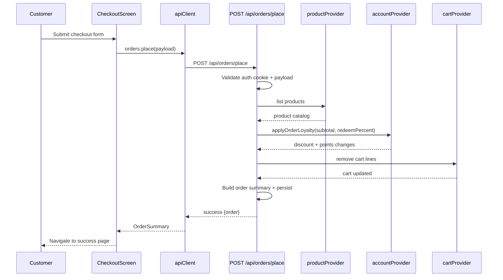
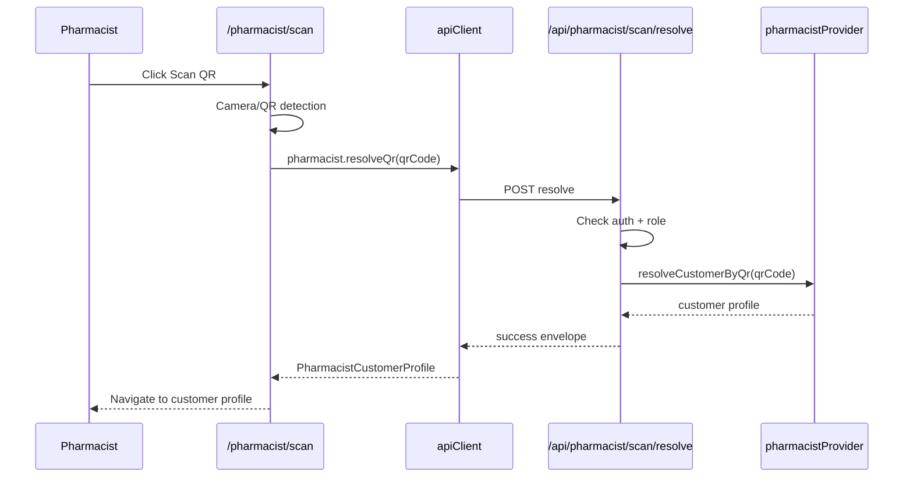

# Real Cosmetics Technical Implementation Documentation

Last updated: 2026-02-26
Source of truth files:
- `Requirments.md`
- `RequirementClosureMatrix.md`
- `AGENTS.md`

## Documentation Update Checklist (Feature Freeze)
Use this checklist every time a feature is completed and frozen.

1. Update `Last updated` date.
2. Add or update affected scope in this file:
- feature summary and status
- routes/URLs changed
- API endpoints changed
- request/response contract changes
- role/security rule changes
- data flow changes
3. Update path references for all touched files.
4. Confirm type contract alignment with:
- `packages/providers/contracts/*.ts`
- `packages/app/lib/types.ts`
- `packages/app/lib/endpoints.ts`
5. Add a dated note in:
- `23) Documentation Consistency Audit`
6. Run validation before merge:
- `yarn run -T tsc --noEmit`
- `yarn guard:checks`
7. Merge code and documentation in the same PR.

## 1) Scope and Intent
This document describes the implemented technical system in detail:
- Requirements and implementation mapping
- Architecture and dependency direction
- Runtime data flow
- Monorepo paths and ownership
- Web URLs and mobile navigation surfaces
- BFF API URLs, auth rules, request/response contracts
- Provider contracts and key data types
- Security and role enforcement
- Known gaps and next steps

This is an implementation-level document (not only a plan). Paths, contracts, and endpoint behavior are based on current repository code.

## 2) Requirements Baseline
Primary business/product baseline is defined in:
- `Requirments.md`
- `RequirementClosureMatrix.md`

Core mandates reflected in implementation:
- Premium commerce UI and structured UX
- Multi-channel: Next.js web + Expo mobile
- Canonical data flow: `UI -> apiClient -> BFF -> provider registry -> adapters`
- Adapter-based external integration model
- CMS-driven mutable content
- Role boundaries: customer, pharmacist, admin
- RTL/LTR readiness

## 3) Architecture and Dependency Direction
Canonical chain (enforced by policy in `AGENTS.md`):
`UI -> apiClient -> BFF routes -> @real/providers registry -> @real/adapters`

Dependency rules:
- `packages/ui` must not import providers/adapters.
- `packages/app` can call providers only through API client and web BFF routes.
- BFF routes import providers, never adapters directly.
- Adapters encapsulate infra/mock/provider implementations.

Key files:
- Provider registry: `packages/providers/registry.ts`
- Provider contracts: `packages/providers/contracts/*.ts`
- API client: `packages/app/lib/api-client.ts`
- BFF utilities: `apps/next/app/api/_lib/*`

## 4) Monorepo Implementation Map

### 4.1 Apps
- Web app + BFF: `apps/next`
- Mobile app: `apps/expo`

### 4.2 Shared packages
- Shared app features/screens/domain types: `packages/app`
- Shared UI primitives/components: `packages/ui`
- Design tokens: `packages/tokens`
- Provider contracts/registry: `packages/providers`
- Adapter implementations (currently mock): `packages/adapters`

### 4.3 Contract and adapter files
- Contracts index: `packages/providers/contracts/index.ts`
- Major contracts:
  - `ProductProvider.ts`
  - `CartProvider.ts`
  - `OrderProvider.ts`
  - `AuthProvider.ts`
  - `CMSProvider.ts`
  - `ReviewProvider.ts`
  - `AccountProvider.ts`
  - `PharmacistProvider.ts`
- Mock adapters:
  - `packages/adapters/mock/*`

## 5) Runtime Surfaces and URLs

### 5.1 Web page URLs (`apps/next/app/**/page.tsx`)
Public/commerce surfaces:
- `/` -> `apps/next/app/page.tsx`
- `/shop` -> `apps/next/app/shop/page.tsx`
- `/search` -> `apps/next/app/search/page.tsx`
- `/sales` -> `apps/next/app/sales/page.tsx`
- `/product/[id]` -> `apps/next/app/product/[id]/page.tsx`
- `/cart` -> `apps/next/app/cart/page.tsx`
- `/checkout` -> `apps/next/app/checkout/page.tsx`
- `/checkout/success` -> `apps/next/app/checkout/success/page.tsx`

Auth/account/order surfaces:
- `/auth/login` -> `apps/next/app/auth/login/page.tsx`
- `/auth/register` -> `apps/next/app/auth/register/page.tsx`
- `/auth/forgot-password` -> `apps/next/app/auth/forgot-password/page.tsx`
- `/auth/reset-password` -> `apps/next/app/auth/reset-password/page.tsx`
- `/account` -> `apps/next/app/account/page.tsx`
- `/account/tests` -> redirects to `/account?tab=tests`
- `/account/tests/[id]` -> `apps/next/app/account/tests/[id]/page.tsx`
- `/orders` -> redirects to `/account?tab=orders`
- `/orders/[id]` -> `apps/next/app/orders/[id]/page.tsx`

Role-gated surfaces:
- `/admin` -> `apps/next/app/admin/page.tsx`
- `/pharmasset` -> redirects to `/pharmacist`
- `/pharmacist` -> redirects to `/pharmacist/scan`
- `/pharmacist/scan`
- `/pharmacist/customer/[id]`
- `/pharmacist/customer/[id]/new-test`
- `/pharmacist/customer/[id]/review`

### 5.2 Expo navigation surfaces (`apps/expo/app/index.tsx`)
Single-entry route with view switching via `ExpoView` union:
- `home`
- `categories`
- `deals`
- `search`
- `product`
- `cart`
- `checkout`
- `account`
- `account-test-detail`
- `orders`
- `order-detail`
- auth views (`auth-login`, `auth-register`, `auth-forgot`)

Note: Expo is implemented as a stateful view model, while web uses URL-based App Router pages.

## 6) Middleware and Access Control
Middleware file: `apps/next/proxy.ts`

Role model:
- `customer`
- `pharmacist`
- `admin`

Session source:
- signed cookie `rc_auth_session`
- cookie signature validated in middleware with HMAC secret

Current gating rules:
- `customerProtectedPrefixes = ['/account', '/orders', '/users']`
- `pharmacistPrefixes = ['/pharmacist', '/pharmasset']`
- `adminPrefixes = ['/admin']`
- Unauthenticated protected access redirects to `/auth/login?next=<path>`
- Pharmacist hitting `/account*` redirects to `/pharmacist`

## 7) API Layer (BFF) and Response Contract
All BFF routes return normalized envelope:
- success: `{ success: true, data: T }`
- failure: `{ success: false, error: { code, message } }`

Utilities:
- `ok`, `fail` in `apps/next/app/api/_lib/response.ts`
- auth cookie helpers in `apps/next/app/api/_lib/auth-session.ts`
- auth session gate in `apps/next/app/api/_lib/request-auth.ts`

## 8) API URL Catalog

### 8.1 Auth
- `POST /api/auth/login`
- `POST /api/auth/logout`
- `POST /api/auth/register`
- `POST /api/auth/request-reset`
- `POST /api/auth/reset-password`
- `GET /api/auth/session`

Auth session behavior:
- `/api/auth/session` uses signed cookie as source of truth.
- Adapter process-memory fallback was removed to prevent stale role leakage.

### 8.2 Products/Search/Reviews/CMS
- `GET /api/products`
- `GET /api/products/[id]`
- `GET /api/search?q=<query>`
- `GET /api/reviews?productId=<id>`
- `POST /api/reviews`
- `GET /api/cms/home`

### 8.3 Cart
- `GET /api/cart`
- `POST /api/cart/add`
- `POST /api/cart/remove`
- `POST /api/cart/set-quantity`

### 8.4 Orders
- `GET /api/orders`
- `GET /api/orders/[id]`
- `POST /api/orders/place`

Order security model (implemented):
- Orders endpoints require auth session.
- Non-admin order list is filtered by explicit ownership (`ownerUserId`) with legacy fallback.
- Non-admin detail access checks order ownership and returns 404 if not owned.

### 8.5 Account
- `GET /api/account/overview`
- `GET /api/account/addresses`
- `POST /api/account/addresses`
- `PATCH /api/account/addresses/[id]`
- `DELETE /api/account/addresses/[id]`
- `POST /api/account/addresses/[id]/set-default`
- `GET /api/account/loyalty`
- `GET /api/account/wishlist`
- `GET /api/account/tests`
- `GET /api/account/tests/[id]`
- `GET /api/account/qr`

### 8.6 Pharmacist
- `GET /api/pharmacist/customers/search?q=<query>`
- `GET /api/pharmacist/customers/[id]`
- `GET /api/pharmacist/products/search?q=<query>`
- `POST /api/pharmacist/scan/resolve`
- `POST /api/pharmacist/consultations/draft`
- `POST /api/pharmacist/consultations/submit`

Role enforcement:
- pharmacist/admin only.

### 8.7 Admin
- `POST /api/admin/orders/[id]/status`

Role enforcement:
- admin only.

## 9) API Client and Endpoint Map
Client file:
- `packages/app/lib/api-client.ts`

Endpoint constants:
- `packages/app/lib/endpoints.ts`

`apiClient` domains:
- `products`
- `search`
- `cart`
- `orders`
- `reviews`
- `cms`
- `auth`
- `account`
- `admin`
- `pharmacist`

Behavior defaults:
- `fetch` uses `credentials: 'include'`
- `cache: 'no-store'`
- throws typed errors from normalized API envelopes

## 10) Data Types and Contracts

### 10.1 Provider result envelope
`packages/providers/contracts/types.ts`
- `ProviderResult<T>` = success/failure tagged union
- `matchProviderResult` helper

### 10.2 Key domain types
From `packages/providers/contracts` and mirrored app types in `packages/app/lib/types.ts`:
- `Product`
- `Cart`, `CartItem`
- `Order`, `OrderStatus`
- `AuthSession`, `AuthRole`
- `CMSHome`, `LocalizedText`
- `Review`
- Account domain:
  - `AccountOverview`
  - `AccountAddress`
  - `LoyaltyWallet`, `LoyaltyHistoryEntry`, `LoyaltyTierProgress`
  - `WishlistItem`
  - `AccountTestRecord`, `AccountTestDetail`
  - `AccountQr`
- Pharmacist domain:
  - `PharmacistCustomerSummary`, `PharmacistCustomerProfile`
  - `PharmacistConsultationInput`, `PharmacistConsultationDraft`

### 10.3 Ownership hardening in orders
`Order.ownerUserId?: string` introduced and implemented in:
- Contract: `packages/providers/contracts/OrderProvider.ts`
- App type: `packages/app/lib/types.ts`
- Persist on order placement: `apps/next/app/api/orders/place/route.ts`
- Mock seed/normalization: `packages/adapters/mock/order/index.ts`

## 11) Feature Implementation Details

### 11.1 Shell/Header/Search
Main files:
- `packages/app/features/shell/Header.tsx`
- `packages/app/features/shell/Layout.tsx`
- `packages/app/features/shell/useHeaderSearch.ts`
- `packages/ui/components/chrome/*`

Implemented behavior:
- top campaign bar, logo, search, account/wishlist/cart icons
- search panel with suggestions/trending/popular/recent
- cart drawer actions and counts
- web account icon role-aware routing via `/api/auth/session`

### 11.2 Shop and Product
Main files:
- `packages/app/screens/ShopScreen.tsx`
- `packages/ui/components/shop/ShopCatalogView.tsx`
- `packages/app/screens/ProductScreen.tsx`
- `packages/ui/components/ProductCard.tsx`

Implemented behavior:
- product listing, sorting/filter controls, responsive behavior
- PDP details, add-to-cart, stock messaging, review integration
- hover/tap action variants for card interactions

### 11.3 Cart and Checkout
Main files:
- `packages/app/screens/CartScreen.tsx`
- `packages/app/screens/CheckoutScreen.tsx`
- `apps/next/app/checkout/page.tsx`
- `apps/next/app/api/orders/place/route.ts`

Implemented behavior:
- cart operations (add/remove/set-quantity)
- checkout form, fulfillment mode, payment method constraints
- branch pickup + payment rule checks from CMS config
- loyalty redemption integration in order pricing
- address persistence/default handling during delivery checkout

### 11.4 Account (Tabs in one page)
Main files:
- `apps/next/app/account/page.tsx`
- `packages/app/screens/AccountScreen.tsx`
- `packages/app/screens/AccountTestDetailScreen.tsx`
- `apps/next/app/account/tests/[id]/page.tsx`

Implemented tabs:
- Dashboard
- Orders
- Tests
- Addresses
- Loyalty
- Wishlist
- Settings

Address management:
- add/edit/delete/set-default via account APIs
- edit uses form-prefill and full field update
- delete confirm with async action

Tests + QR:
- account test list and detail
- QR display in tests tab via `AccountQrPreview`
- Expo account supports in-page test-detail navigation state (`account-test-detail`) with:
- `onSelectTest` -> load detail (`apiClient.account.test`)
- retry on failure
- add-one/add-all recommended products to cart from test detail

### 11.5 Pharmacist Flow
Web pages:
- `/pharmacist/scan`
- `/pharmacist/customer/[id]`
- `/pharmacist/customer/[id]/new-test`
- `/pharmacist/customer/[id]/review`

Main files:
- `apps/next/app/pharmacist/_components/PharmacistRouteShell.tsx`
- route pages under `apps/next/app/pharmacist/**`

Implemented workflow:
1. Search or scan customer QR
2. Review customer history
3. Create new test and select recommendations
4. Review and submit consultation

Key implementation details:
- Browser camera scan with `BarcodeDetector` and `jsqr` fallback
- QR resolve endpoint integration
- draft persistence in `sessionStorage`
- remove recommended item before submit
- responsive layout improvements in pharmacist pages

### 11.6 Admin
Main files:
- `apps/next/app/admin/page.tsx`
- `apps/next/app/api/admin/orders/[id]/status/route.ts`

Implemented behavior:
- admin dashboard surface
- order status transitions:
  - `placed -> shipped -> delivered`
  - cancellation path subject to transition rules

## 12) Data Flows

### 12.1 Web account load flow
1. `GET /account` page mounts (`apps/next/app/account/page.tsx`)
2. fetches session + cms + products + cart
3. if no session -> redirect `/auth/login?next=/account`
4. fetches orders + overview + addresses + loyalty + wishlist + tests + qr
5. renders `AccountScreen` with URL-driven tab state

### 12.2 Place order flow
1. UI sends `POST /api/orders/place`
2. route validates auth from signed cookie
3. validates contact/fulfillment/payment conditions
4. computes subtotal from product provider
5. applies loyalty discount via account provider rules
6. clears cart lines
7. persists order summary to mock storage
8. returns normalized order payload

### 12.3 Pharmacist QR flow
1. pharmacist opens `/pharmacist/scan`
2. camera scan yields QR value
3. client calls `POST /api/pharmacist/scan/resolve`
4. BFF validates role and resolves profile via provider
5. client navigates to `/pharmacist/customer/[id]`

## 13) Security and Session Mechanics

### 13.1 Session cookie
- name: `rc_auth_session`
- httpOnly, sameSite=lax, max-age 7 days
- signed with HMAC SHA-256
- helpers in `apps/next/app/api/_lib/auth-session.ts`

### 13.2 API auth gate
- `requireAuthSession(request)` used on protected endpoints
- returns standardized `AUTH_REQUIRED` (401) if missing/invalid

### 13.3 Route role boundaries
- configured in `apps/next/proxy.ts`
- customer protected paths include `/account`, `/orders`, `/users`
- pharmacist/admin restrictions enforced in middleware and API handlers

## 14) Requirements to Implementation Mapping (Condensed)

### R: Core architecture chain
Implemented by:
- `packages/app/lib/api-client.ts`
- `apps/next/app/api/*`
- `packages/providers/registry.ts`
- `packages/adapters/*`
Status: Implemented

### R: Smart header + search + cart access
Implemented by:
- `packages/app/features/shell/Header.tsx`
- `packages/ui/components/chrome/SearchPanel.tsx`
- `packages/ui/components/chrome/CartDrawer.tsx`
Status: Implemented (ongoing polish)

### R: Shop/PDP/cart/checkout/account/orders
Implemented by:
- `packages/app/screens/*`
- `apps/next/app/*` routes
Status: Implemented baseline; ongoing UX hardening

### R: Loyalty
Implemented by:
- `apps/next/app/api/account/loyalty/route.ts`
- account loyalty wallet/history UI in `packages/app/screens/AccountScreen.tsx`
- checkout loyalty redeem controls in checkout screen and order placement route
Status: Implemented baseline

### R: Pharmacist tool
Implemented by:
- pharmacist pages and APIs under `apps/next/app/pharmacist/*` and `/api/pharmacist/*`
Status: Implemented baseline workflow

### R: CMS controls content, not layout
Implemented by:
- `apps/next/app/api/cms/home/route.ts`
- CMS-driven shell and marketing strings in screens
Status: Implemented baseline

### R: Security/roles
Implemented by:
- `apps/next/proxy.ts`
- role checks in protected APIs
Status: Implemented with recent hardening

## 15) Recent Hardening Changes (Latest)
- Fixed stale role/session behavior on account routing by making `/api/auth/session` rely on signed cookie only.
- Added ownership-aware order security:
  - `ownerUserId` field
  - auth-required order APIs
  - non-admin scoped list/detail access
- Protected `/account` in middleware server-side.
- Improved account address UX and correctness:
  - real edit flow
  - async-safe delete confirmation
- Fixed pharmacist page responsiveness on narrow widths.
- Enforced scroll ownership at UI primitive layer:
  - added shared scroll primitives in `packages/ui/primitives/Scroll.tsx`
  - exported via `packages/ui/primitives/index.ts`
  - removed direct `ScrollView` usage from `packages/app/screens/*`
  - feature screens now consume `VerticalScroll` / `HorizontalScroll` from `@real/ui/primitives`
- Expo account flow fixes:
  - wired test result navigation to `AccountTestDetailScreen`
  - account orders tab now triggers explicit reload on tab switch
  - checkout order placement now updates local Expo orders state immediately

## 16) Environment and Config
From project policy and implementation:
- `USE_MOCK`
- `AUTH_SESSION_SECRET`
- API base URLs for web/expo are configured through app-level clients

Current provider registry behavior:
- `packages/providers/registry.ts` currently maps both `USE_MOCK` branches to mock adapters (ready for live adapter wiring).

## 17) Validation and Checks
Recommended commands:
- Typecheck: `yarn run -T tsc --noEmit`
- Guard checks: `yarn guard:checks`

Current environment note:
- In this shell, `rg` may be unavailable; guard script categories relying on `rg` will fail until installed.

## 18) Known Gaps and Next Recommended Work
1. Wire real adapters in `packages/providers/registry.ts` for ERP/payment/auth when available.
2. Complete role-specific UX refinements on admin/pharmacist/account surfaces.
3. Expand automated coverage for role boundary tests and order ownership assertions.
4. Final visual parity pass for RTL/LTR and web/expo responsiveness.

## 19) Path Index (Quick Reference)
- Requirements: `Requirments.md`
- Closure matrix: `RequirementClosureMatrix.md`
- Execution policy: `AGENTS.md`
- API client: `packages/app/lib/api-client.ts`
- Endpoints map: `packages/app/lib/endpoints.ts`
- Shared types: `packages/app/lib/types.ts`
- Provider contracts: `packages/providers/contracts/*.ts`
- Provider registry: `packages/providers/registry.ts`
- Web middleware: `apps/next/proxy.ts`
- BFF routes: `apps/next/app/api/**/route.ts`
- Account web route: `apps/next/app/account/page.tsx`
- Account shared screen: `packages/app/screens/AccountScreen.tsx`
- Pharmacist routes: `apps/next/app/pharmacist/**`
- Expo entry/navigation shell: `apps/expo/app/index.tsx`

## 20) API Reference (Detailed)
All APIs return the normalized envelope:
- success: `{ "success": true, "data": ... }`
- failure: `{ "success": false, "error": { "code": "...", "message": "..." } }`

### 20.1 Auth APIs
`POST /api/auth/login`
- Request:
```json
{ "email": "user", "password": "user" }
```
- Success data type: `AuthSession`
```json
{
  "success": true,
  "data": {
    "userId": "u-1",
    "email": "user@realcosmetics.local",
    "name": "Customer User",
    "role": "customer"
  }
}
```

`POST /api/auth/register`
- Request:
```json
{ "name": "New User", "email": "new@realcosmetics.local", "password": "pass1234" }
```
- Success: `201` + `AuthSession`

`POST /api/auth/logout`
- Request: `{}`
- Success data:
```json
{ "accepted": true }
```

`GET /api/auth/session`
- Request body: none
- Behavior: signed cookie (`rc_auth_session`) source of truth.
- Success data: `AuthSession | null`

`POST /api/auth/request-reset`
- Request:
```json
{ "email": "user@realcosmetics.local" }
```
- Success data: `{ "accepted": true }`

`POST /api/auth/reset-password`
- Request:
```json
{ "token": "reset-u-1", "newPassword": "newpass1234" }
```
- Success data: `{ "accepted": true }`

### 20.2 Product/Search/Review/CMS APIs
`GET /api/products`
- Success data type: `Product[]`

`GET /api/products/:id`
- Success data type: `Product`
- 404: product not found

`GET /api/search?q=<query>`
- Success data type:
```ts
{
  suggestions: SearchSuggestion[]
  trendingSearches: string[]
  popularBrands: string[]
}
```

`GET /api/reviews?productId=<id>`
- Success data type: `Review[]`

`POST /api/reviews`
- Request:
```json
{
  "productId": "1",
  "rating": 5,
  "title": "Great",
  "body": "Loved it",
  "author": "Demo User"
}
```
- Success data type: `Review`

`GET /api/cms/home`
- Success data type: `CMSHome`

### 20.3 Cart APIs
`GET /api/cart`
- Success data type:
```ts
{
  items: Array<{ productId: string; quantity: number }>
  updatedAt: string
}
```

`POST /api/cart/add`
- Request:
```json
{ "productId": "1", "quantity": 1 }
```
- Success data type: `Cart`

`POST /api/cart/remove`
- Request:
```json
{ "productId": "1" }
```
- Success data type: `Cart`

`POST /api/cart/set-quantity`
- Request:
```json
{ "productId": "1", "quantity": 2 }
```
- Success data type: `Cart`

### 20.4 Order APIs
`GET /api/orders`
- Auth required.
- Customer: returns only own orders.
- Admin: returns all orders.
- Success data type: `OrderSummary[]`

`GET /api/orders/:id`
- Auth required.
- Customer: only if owns the order.
- Admin: unrestricted.
- Success data type: `OrderSummary`

`POST /api/orders/place`
- Auth required.
- Request (delivery example):
```json
{
  "contact": { "fullName": "Mohammad", "phone": "+962..." },
  "address": {
    "city": "Amman",
    "area": "Dabouq",
    "building": "12",
    "floor": "3",
    "apartment": "9"
  },
  "addressBook": { "saveAsNew": true, "label": "Home" },
  "fulfillment": { "mode": "delivery" },
  "payment": { "method": "cod" },
  "loyalty": { "redeemPercent": 10 }
}
```
- Success data type: `OrderSummary`
- Important fields:
  - `id`: `ord-<userId>-<timestamp>`
  - `ownerUserId`: user owner ID
  - `pricing.subtotal`, `pricing.delivery`, `pricing.discount`
  - `fulfillment.mode`, `fulfillment.paymentMethod`

### 20.5 Account APIs
All require auth (`customer/admin/pharmacist by session as allowed by provider behavior`).

`GET /api/account/overview`
- Success data: `AccountOverview`

`GET /api/account/addresses`
- Success data: `AccountAddress[]`

`POST /api/account/addresses`
- Request:
```json
{
  "label": "Home",
  "city": "Amman",
  "area": "Dabouq",
  "building": "12",
  "floor": "3",
  "apartment": "9"
}
```
- Success data: updated `AccountAddress[]`

`PATCH /api/account/addresses/:id`
- Request (partial):
```json
{ "label": "Work", "city": "Amman" }
```
- Success data: updated `AccountAddress[]`

`DELETE /api/account/addresses/:id`
- Success data: updated `AccountAddress[]`

`POST /api/account/addresses/:id/set-default`
- Success data: updated `AccountAddress[]`

`GET /api/account/loyalty`
- Success data:
```ts
{
  summary: AccountOverview['loyaltySummary']
  wallet: LoyaltyWallet | null
  history: LoyaltyHistoryEntry[]
}
```

`GET /api/account/wishlist`
- Success data: `WishlistItem[]`

`GET /api/account/tests`
- Success data: `AccountTestRecord[]`

`GET /api/account/tests/:id`
- Success data: `AccountTestDetail`

`GET /api/account/qr`
- Success data:
```json
{ "qrCode": "RC-U1-2026-9X2K" }
```

### 20.6 Pharmacist APIs
All require auth and role: `pharmacist` or `admin`.

`GET /api/pharmacist/customers/search?q=<query>`
- Success data: `PharmacistCustomerSummary[]`

`GET /api/pharmacist/customers/:id`
- Success data: `PharmacistCustomerProfile`

`GET /api/pharmacist/products/search?q=<query>`
- Success data: product list for recommendation selection

`POST /api/pharmacist/scan/resolve`
- Request:
```json
{ "qrCode": "RC-U1-2026-9X2K" }
```
- Success data: `PharmacistCustomerProfile`

`POST /api/pharmacist/consultations/draft`
- Request data type: `PharmacistConsultationInput`
- Success data type: `PharmacistConsultationDraft`

`POST /api/pharmacist/consultations/submit`
- Request data type: `PharmacistConsultationInput` (wrapped by BFF)
- Success data type: `AccountTestDetail`

### 20.7 Admin APIs
`POST /api/admin/orders/:id/status`
- Admin only
- Request:
```json
{ "status": "shipped" }
```
- Allowed statuses: `placed | shipped | delivered | cancelled`
- Success data: updated `OrderSummary`

## 21) Sequence Diagrams (Mermaid)

### 21.1 Account Page Load


### 21.2 Place Order (Delivery + Loyalty)


### 21.3 Pharmacist QR Flow


## 22) Deployment Runbook

### 22.1 Prerequisites
- Node.js (project currently using Yarn 4 workflow)
- Yarn via corepack
- `rg` installed for guard checks
- Environment variables configured

### 22.2 Required Environment Variables
Minimum expected (from policy + current implementation):
- `USE_MOCK`
- `AUTH_SESSION_SECRET`
- `NEXT_PUBLIC_API_BASE_URL`
- `EXPO_PUBLIC_API_BASE_URL`
- `ODOO_URL`
- `ODOO_SECRET`
- `PAYMENT_GATEWAY_URL`
- `PAYMENT_GATEWAY_SECRET`
\nCreate/maintain in `.env.example` and runtime env files.

### 22.3 Local Startup
Web:
```bash
yarn workspace @real/next dev
```

Expo:
```bash
yarn workspace @real/expo start
```

### 22.4 Validation Checklist (Pre-merge)
1. Typecheck:
```bash
yarn run -T tsc --noEmit
```
2. Guard checks:
```bash
yarn guard:checks
```
3. Manual smoke flows:
- Guest: browse/shop/cart/checkout gate to login on place order.
- Customer: login -> place order -> see order in account.
- Pharmacist: login -> scan/search customer -> create test -> submit.
- Admin: login -> update order status.

### 22.5 Release Checklist
1. Confirm `USE_MOCK=false` in target environment when live adapters are ready.
2. Wire real adapters in `packages/providers/registry.ts`.
3. Verify auth secret is production-grade (no fallback).
4. Run smoke tests against staging APIs.
5. Confirm role boundary tests pass (`customer`, `pharmacist`, `admin`).
6. Validate RTL/LTR render on critical surfaces.

### 22.6 Rollback Strategy
Fast rollback options:
1. Revert deployment artifact to previous known-good build.
2. Toggle provider to mock mode only for emergency fallback (`USE_MOCK=true`) in controlled non-production environments.
3. Preserve database/order integrity by never mutating order history in rollback scripts.
4. Re-run auth + order ownership smoke checks after rollback.

### 22.7 Observability Recommendations
- Capture BFF failures from `fail(...)` scopes in centralized logs.
- Track key error codes:
  - `AUTH_REQUIRED`
  - `ORDER_PLACE_*`
  - `ACCOUNT_*`
  - `PHARMACIST_*`
  - `ADMIN_ORDER_STATUS_*`
- Add alerting on elevated 5xx rates on `/api/orders/place`, `/api/account/*`, `/api/pharmacist/*`.

## 23) Documentation Consistency Audit

### 23.1 Audit Scope
Validated this document against the live repository for:
- Web routes in `apps/next/app/**/page.tsx`
- API routes in `apps/next/app/api/**/route.ts`
- Middleware behavior in `apps/next/proxy.ts`
- Referenced implementation paths under `packages/app`, `packages/ui`, `packages/providers`, and `packages/adapters`

### 23.2 Audit Result
- Status: Pass
- Literal file/path references in this document resolve to existing files.
- Route and API catalogs match current implemented pages and BFF routes.
- Wildcard references (for example `apps/next/app/**/page.tsx`) are intentional pattern references, not broken paths.

### 23.3 Audit Timestamp
- Executed on: 2026-02-24

## 24) API Contracts Reference (Typed, In-Document)

### 24.1 Canonical Envelope
All BFF responses are normalized to:

```ts
type ApiResponse<T> =
  | { success: true; data: T }
  | { success: false; error: { code: string; message: string } }
```

Sources:
- `packages/app/lib/types.ts`
- `apps/next/app/api/_lib/response.ts`

### 24.2 Contract Source of Truth (Types)
Primary type definitions used by routes:
- `packages/providers/contracts/AuthProvider.ts`
- `packages/providers/contracts/ProductProvider.ts`
- `packages/providers/contracts/CartProvider.ts`
- `packages/providers/contracts/OrderProvider.ts`
- `packages/providers/contracts/ReviewProvider.ts`
- `packages/providers/contracts/AccountProvider.ts`
- `packages/providers/contracts/PharmacistProvider.ts`
- `packages/providers/contracts/CMSProvider.ts`

App-facing mirrored types:
- `packages/app/lib/types.ts`
- `packages/app/lib/endpoints.ts`

### 24.3 Auth Contracts

`POST /api/auth/login`
- Request body:
```ts
{ email: string; password: string }
```
- Success payload: `AuthSession`
- Side effect: sets signed auth cookie (`rc_auth_session`)

`POST /api/auth/register`
- Request body:
```ts
{ name: string; email: string; password: string }
```
- Success payload: `AuthSession`
- Side effect: sets signed auth cookie (`rc_auth_session`)

`POST /api/auth/logout`
- Request body: none
- Success payload: `AuthRequestAck` (`{ accepted: boolean }`)
- Side effect: clears auth cookie

`GET /api/auth/session`
- Request body: none
- Success payload: `AuthSession | null`

`POST /api/auth/request-reset`
- Request body:
```ts
{ email: string }
```
- Success payload: `AuthRequestAck`

`POST /api/auth/reset-password`
- Request body:
```ts
{ token: string; newPassword: string }
```
- Success payload: `AuthRequestAck`

### 24.4 Catalog + Search + CMS Contracts

`GET /api/products`
- Success payload: `Product[]`

`GET /api/products/:id`
- Success payload: `Product`

`Product` (current contract shape):
```ts
{
  id: string
  name: string
  description?: string
  price: number
  currency: string
  image?: string
  rating?: number
  reviews?: number
  isNew?: boolean
  isLimited?: boolean
  stock?: number
}
```

`GET /api/search?q=<query>`
- Success payload: `SearchResult`

`GET /api/reviews?productId=<id>`
- Success payload: `Review[]`

`POST /api/reviews`
- Request body:
```ts
{
  productId: string
  rating: number
  title: string
  body: string
  author: string
}
```
- Success payload: `Review`

`GET /api/cms/home`
- Success payload: `CMSHome`

### 24.5 Cart Contracts

`GET /api/cart`
- Success payload: `Cart`

`POST /api/cart/add`
- Request body:
```ts
{ productId: string; quantity: number }
```
- Success payload: `Cart`

`POST /api/cart/remove`
- Request body:
```ts
{ productId: string }
```
- Success payload: `Cart`

`POST /api/cart/set-quantity`
- Request body:
```ts
{ productId: string; quantity: number } // quantity >= 0
```
- Success payload: `Cart`

### 24.6 Orders Contracts

`GET /api/orders`
- Auth required.
- Success payload: `Order[]`
- Ownership scoped for customer role.

`GET /api/orders/:id`
- Auth required.
- Success payload: `Order`
- Ownership enforced for customer role.

`POST /api/orders/place`
- Auth required.
- Request body (normalized):
```ts
type CheckoutPlaceOrderInput = {
  items?: Array<{ productId: string; quantity: number }>
  contact: { fullName: string; phone: string }
  address?: {
    city: string
    area: string
    building: string
    floor?: string
    apartment?: string
    notes?: string
  }
  addressBook?: { saveAsNew?: boolean; label?: string }
  loyalty?: { redeemPercent?: number }
  fulfillment: { mode: 'delivery' | 'pickup'; branchId?: string }
  payment: { method: 'cod' | 'card_on_delivery' | 'online_card' | 'pay_at_branch' }
}
```
- Success payload: `Order`
- Guarantees:
1. empty cart blocked
2. contact validation
3. fulfillment/payment compatibility validation
4. address auto-save/default sync behavior
5. loyalty discount application
6. persisted order includes `ownerUserId`

### 24.7 Account Contracts

All account endpoints require auth.

`GET /api/account/overview`
- Success payload: `AccountOverview`

`GET /api/account/addresses`
- Success payload: `AccountAddress[]`

`POST /api/account/addresses`
- Request body:
```ts
{
  label: string
  city: string
  area: string
  building: string
  floor?: string
  apartment?: string
}
```
- Success payload: `AccountAddress[]`

`PATCH /api/account/addresses/:id`
- Request body:
```ts
Partial<{
  label: string
  city: string
  area: string
  building: string
  floor: string
  apartment: string
}>
```
- Success payload: `AccountAddress[]`

`DELETE /api/account/addresses/:id`
- Success payload: `AccountAddress[]`

`POST /api/account/addresses/:id/set-default`
- Success payload: `AccountAddress[]`

`GET /api/account/loyalty`
- Success payload:
```ts
{
  summary: AccountOverview['loyaltySummary']
  wallet: LoyaltyWallet | null
  history: LoyaltyHistoryEntry[]
}
```

`GET /api/account/wishlist`
- Success payload: `WishlistItem[]`

`GET /api/account/tests`
- Success payload: `AccountTestRecord[]`

`GET /api/account/tests/:id`
- Success payload: `AccountTestDetail`

`GET /api/account/qr`
- Success payload: `AccountQr` (`{ qrCode: string }`)

### 24.8 Pharmacist Contracts

All endpoints require auth role `pharmacist` or `admin`.

`GET /api/pharmacist/customers/search?q=<query>`
- Success payload: `PharmacistCustomerSummary[]`

`GET /api/pharmacist/customers/:id`
- Success payload: `PharmacistCustomerProfile`

`GET /api/pharmacist/products/search?q=<query>`
- Success payload:
```ts
Array<{
  id: string
  brand?: string
  name: string
  price: number
  currency: string
  imageUrl?: string
}>
```

`POST /api/pharmacist/scan/resolve`
- Request body:
```ts
{ qrCode: string }
```
- Success payload: `PharmacistCustomerProfile`

`POST /api/pharmacist/consultations/draft`
- Request body: `PharmacistConsultationInput`
- Success payload: `PharmacistConsultationDraft`

`POST /api/pharmacist/consultations/submit`
- Request body: `PharmacistConsultationInput`
- Success payload: `AccountTestDetail`

### 24.9 Admin Contracts

`POST /api/admin/orders/:id/status`
- Auth required, role `admin`.
- Request body:
```ts
{ status: 'placed' | 'shipped' | 'delivered' | 'cancelled' }
```
- Success payload: `Order`
- Invalid transition behavior:
1. `ORDER_NOT_FOUND` -> `404`
2. `ORDER_STATUS_INVALID_TRANSITION` -> `409`
3. validation/provider errors -> `400`

### 24.10 Contract Versioning Guidance
For future live adapters:
1. Keep request/response shapes stable at BFF boundary.
2. If ERP schema changes, adapt in `packages/adapters/*` only.
3. Update provider contracts only when business capability changes, not when infrastructure changes.
4. Treat this section and `packages/providers/contracts/*` as the authoritative integration contract for UI and external teams.

### 24.11 Sales Campaign Hybrid CMS Contract (Implemented)
Implemented to support conversion-focused zones controlled from CMS without layout rewrites.

Changed type paths:
- `packages/app/lib/types.ts`
- `packages/app/lib/campaigns.ts`

New campaign model:
```ts
type MarketingCampaignZone =
  | 'home_hero_primary'
  | 'home_flash_sale'
  | 'home_inline_banner'
  | 'shop_banner'
  | 'shop_flash_sale'

type MarketingCampaign = {
  id: string
  enabled?: boolean
  zone?: MarketingCampaignZone
  title: LocalizedString
  subtitle?: LocalizedString
  ctaLabel?: LocalizedString
  href?: string
  imageUrl?: string
  timerEndsAt?: string
  urgencyBadge?: LocalizedString
  showTimer?: boolean
  showUrgency?: boolean
}
```

Zone override contract:
```ts
campaignZoneOverrides?: {
  home?: {
    heroPrimaryCampaignId?: string
    flashSaleCampaignId?: string
    inlineBannerCampaignId?: string
  }
  shop?: {
    bannerCampaignId?: string
    flashSaleCampaignId?: string
  }
  productCard?: {
    urgencyEnabled?: boolean
    urgencyLabel?: LocalizedString
    discountBadgeEnabled?: boolean
    lowStockThreshold?: number
    lowStockLabel?: LocalizedString
  }
}
```

Current usage surfaces:
- Home page (`/`): campaign-driven hero lead + flash-sale featured zone.
  - Implementation: `packages/app/screens/HomeV2Screen.tsx`
- Shop page (`/shop`): campaign-driven top banner with optional urgency badge + timer.
  - Implementation: `apps/next/app/shop/page.tsx`
  - View rendering: `packages/app/screens/ShopScreen.tsx`, `packages/ui/components/shop/ShopCatalogView.tsx`
- Product cards: optional CMS-driven urgency label override.
  - Implementation: `packages/ui/components/ProductCard.tsx`, `packages/ui/components/home/types.ts`

Data flow remains canonical and unchanged:
`UI -> apiClient -> /api/cms/home -> provider registry -> mock/live adapter`

Mock data source updated:
- `packages/adapters/mock/cms/index.ts`
  - Added localized campaigns with `zone`, `showTimer`, `showUrgency`, `urgencyBadge`, `timerEndsAt`
  - Added `campaignZoneOverrides` for home, shop, and product card urgency controls

### 24.12 Responsive Stability Pass (Web + Expo Shared Screens)
Date: `2026-03-01`

Scope implemented:
- Pharmacist shared screen responsive cleanup (stack controls on compact widths, remove fixed-width pressure).
- Checkout form compact layout cleanup (city/area and floor/apartment rows now stack on compact widths).
- Account shared screen CTA sizing cleanup on compact widths.
- Pharmacist web flow button containers normalized for narrow viewports.
- Pharmacist shell campaign link wiring corrected to use CMS `ctaHref` rather than CTA label text.

Updated files:
- `packages/app/screens/PharmacistScreen.tsx`
- `packages/app/screens/CheckoutScreen.tsx`
- `packages/app/screens/AccountScreen.tsx`
- `apps/next/app/pharmacist/_components/PharmacistRouteShell.tsx`
- `apps/next/app/pharmacist/scan/page.tsx`
- `apps/next/app/pharmacist/customer/[id]/new-test/page.tsx`
- `apps/next/app/pharmacist/customer/[id]/review/page.tsx`

Behavior notes:
- No BFF/provider/adapter contract changes.
- No routing contract changes.
- No business logic changes; this pass is presentation/responsiveness + shell link fix only.

Verification:
- TypeScript baseline: `yarn tsc --noEmit` passed.
- Local Next dev server booted successfully after patch set.

### 24.13 Admin Surface Link + Compact Grid Fix
Date: `2026-03-01`

Scope implemented:
- Corrected admin/admin-cms shell campaign link binding to use CMS `ctaHref` (link URL) instead of CTA label text.
- Improved admin overview metric card layout on compact widths by collapsing to single-column cards.

Updated files:
- `apps/next/app/admin/page.tsx`
- `apps/next/app/admin/cms/page.tsx`
- `packages/app/screens/AdminScreen.tsx`

Behavior notes:
- No API/BFF/provider/adapter changes.
- No role-guard or route-policy changes.
- Visual/layout + shell link correctness only.

Verification:
- TypeScript baseline: `yarn tsc --noEmit` passed.

### 24.14 Admin CMS + Pharmacist Step Page Compact UX Pass
Date: `2026-03-01`

Scope implemented:
- Improved compact behavior in CMS control surface:
  - Toggle header and spotlight manager headers stack correctly on narrow widths.
  - Spotlight action controls use full-width behavior on compact widths for better touch usability.
- Improved compact behavior in pharmacist step pages:
  - Step 3 (`new-test`) and Step 4 (`review`) headers now stack correctly.
  - Primary header actions (`Back`, `Back to edit`) now avoid clipping and align with compact width.
  - Step 3 consultation metric/search rows adapt to compact width with cleaner vertical flow.

Updated files:
- `packages/app/screens/AdminCmsScreen.tsx`
- `apps/next/app/pharmacist/customer/[id]/new-test/page.tsx`
- `apps/next/app/pharmacist/customer/[id]/review/page.tsx`

Behavior notes:
- UI/UX-only layout adjustments.
- No route, API, provider, adapter, or data contract changes.

Verification:
- TypeScript baseline: `yarn tsc --noEmit` passed.

### 24.15 Account + Checkout Compact Spacing Normalization
Date: `2026-03-01`

Scope implemented:
- Shared account and checkout screens now use compact tokenized page spacing on small widths.
- Keeps the same functional hierarchy while reducing visual crowding on Expo/mobile viewport.

Updated files:
- `packages/app/screens/AccountScreen.tsx`
- `packages/app/screens/CheckoutScreen.tsx`

Behavior notes:
- UI-only spacing/layout normalization.
- No routing, state, provider, adapter, or API changes.

Verification:
- TypeScript baseline: `yarn tsc --noEmit` passed.

### 24.16 Shared Screen Compact Parity Pass (Cart/Orders/Product/Search/Shop)
Date: `2026-03-01`

Scope implemented:
- Added compact tokenized page spacing normalization across remaining core shared screens.
- Improved narrow-width row stacking and fixed-width button behavior to prevent clipping/overlap.
- Preserved all existing flow behavior while tightening mobile/Expo rendering parity with web responsive behavior.

Updated files:
- `packages/app/screens/CartScreen.tsx`
- `packages/app/screens/OrdersScreen.tsx`
- `packages/app/screens/OrderDetailScreen.tsx`
- `packages/app/screens/AccountTestDetailScreen.tsx`
- `packages/app/screens/SearchResultsScreen.tsx`
- `packages/app/screens/ShopScreen.tsx`
- `packages/app/screens/ProductScreen.tsx`

Behavior notes:
- UI/layout-only changes.
- No business logic, provider contracts, adapter wiring, route contracts, or API behavior changed.

Verification:
- TypeScript baseline: `yarn tsc --noEmit` passed.

### 24.17 Page Layout Foundation + Wave 1 Scaffold Migration
Date: `2026-03-01`

Scope implemented:
- Added shared page layout foundation for container width, gutters, section rhythm, and safe bottom handling.
- Added layout token contract for page archetypes and spacing profiles.
- Added shared UI layout primitives:
  - `PageScaffold`
  - `Section`
  - `LayoutContainer` (public alias for layout container)
- Migrated first wave screens to scaffold-driven root layout ownership:
  - Home
  - Cart
  - Checkout

Updated files:
- `packages/tokens/layout.ts`
- `packages/ui/layout/PageScaffold.tsx`
- `packages/ui/layout/Section.tsx`
- `packages/ui/layout/Container.tsx`
- `packages/ui/layout/index.ts`
- `packages/ui/index.ts`
- `packages/app/screens/HomeScreen.tsx`
- `packages/app/screens/CartScreen.tsx`
- `packages/app/screens/CheckoutScreen.tsx`
- `docs/plans/2026-03-01-layout-scaffold-design.md`

Behavior notes:
- No provider/adapters/BFF/data-flow changes.
- No business-logic changes; layout composition ownership moved to shared UI layer.
- `Container` export collision avoided by exporting layout container as `LayoutContainer`.

Verification:
- TypeScript baseline: `yarn run tsc --noEmit` passed.
- Next production build: `apps/next yarn build` passed.

### 24.18 PageScaffold Wave 2 Migration (Commerce + Order/Test Detail)
Date: `2026-03-01`

Scope implemented:
- Migrated additional shared screens to `PageScaffold` + `Section` so root max-width/gutter/rhythm are owned by UI layout layer.
- Removed remaining root-level `VerticalScroll`/manual page padding ownership from the migrated screens.
- Updated commerce width calculations in search/shop to respect scaffold max-width constraints.

Updated files:
- `packages/app/screens/OrdersScreen.tsx`
- `packages/app/screens/OrderDetailScreen.tsx`
- `packages/app/screens/AccountTestDetailScreen.tsx`
- `packages/app/screens/SearchResultsScreen.tsx`
- `packages/app/screens/ShopScreen.tsx`
- `packages/app/screens/ProductScreen.tsx`

Behavior notes:
- UI composition/layout ownership refactor only.
- No provider/adapters/BFF contracts or business logic changes.
- Existing route contracts unchanged.

Verification:
- TypeScript baseline: `yarn run tsc --noEmit` passed.
- Next production build: `apps/next yarn build` passed.

### 24.19 PageScaffold Wave 3 Migration (Account/Auth/Admin/Pharmacist Surfaces)
Date: `2026-03-01`

Scope implemented:
- Migrated remaining shared screen roots in `packages/app/screens` to `PageScaffold` + `Section`.
- Removed root `VerticalScroll` ownership and root `px='pageX'` / `py='sectionY'` ownership from these surfaces.
- Preserved screen behavior and state flows while moving layout ownership to shared UI layout layer.

Updated files:
- `packages/app/screens/CheckoutSuccessScreen.tsx`
- `packages/app/screens/AccountTestsScreen.tsx`
- `packages/app/screens/AuthLoginScreen.tsx`
- `packages/app/screens/AuthRegisterScreen.tsx`
- `packages/app/screens/AuthForgotPasswordScreen.tsx`
- `packages/app/screens/AuthResetPasswordScreen.tsx`
- `packages/app/screens/AdminScreen.tsx`
- `packages/app/screens/AdminCmsScreen.tsx`
- `packages/app/screens/AccountScreen.tsx`
- `packages/app/screens/PharmacistScreen.tsx`

Behavior notes:
- Layout/composition ownership refactor only.
- No BFF/provider/adapter/data-contract changes.
- No role-routing contract changes.

Verification:
- TypeScript baseline: `yarn run tsc --noEmit` passed.
- Next production build: `apps/next yarn build` passed.
