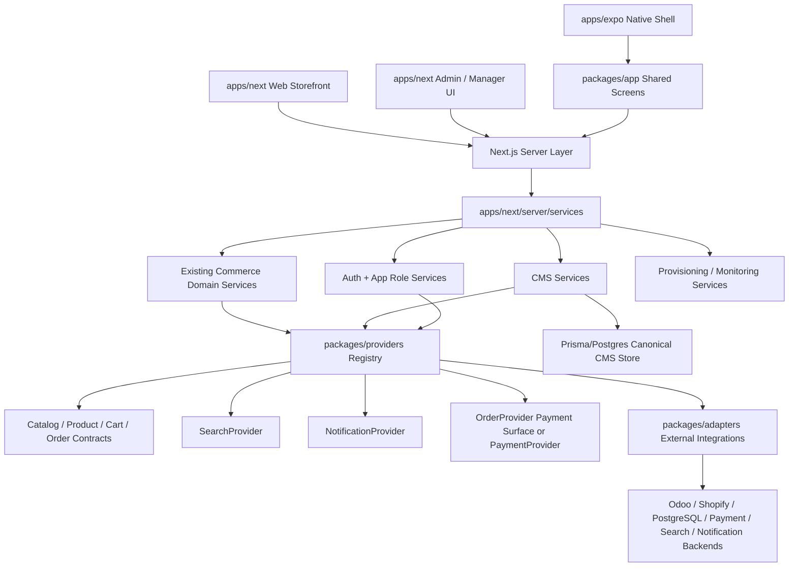

# Commerce Platform Roadmap Design

## Architecture Overview

V1 uses single-client or isolated-client deployments. Store/tenant context exists as a server-side seam but does not expose tenant-facing SaaS UX or shared runtime multi-tenancy.

## Source-Of-Truth Alignment

This design obeys `AGENTS.md` v4.5:

- UI and shared screens do not import adapters.
- Server Components fetch through `apps/next/server/services`.
- Route Handlers and Server Actions stay thin and delegate to services.
- Services consume provider contracts and registry, not adapters.
- Adapters implement external integrations only.
- Shared `packages/` code remains cross-platform.
- CMS canonical store is Prisma/Postgres for mutable admin-editable content.
- Mock CMS/catalog data is seed, fixture, or explicit fallback only.
- Shared UI remains RNR-centered through `packages/ui/components` and `packages/ui/reusables`.
- Before adding commerce contracts, services, screens, or blocks, existing equivalents must be audited and hardened where possible.

## Requirements Coverage

| Requirement Area | Design Coverage |
|---|---|
| Storefront shared screens | `packages/app/screens` plus existing domain screens before new additions |
| Shared UI contract | RNR-centered `packages/ui/components` and `packages/ui/reusables` |
| Product listing/search | `apps/next/server/services/search` -> `SearchProvider` -> search adapter |
| Product detail | `apps/next/server/services/product` / `catalog` -> provider contracts |
| Cart/checkout | Existing `cart` and `checkout` services with provider-backed pricing/order state |
| Payments | Current order-provider payment surface or explicitly approved `PaymentProvider` |
| Orders/write-back | `orders` services -> `OrderProvider` -> merchant adapter |
| CMS blocks/pages | Prisma-backed CMS services -> normalized blocks -> app renderers |
| Platform operations | provisioning service/script design with secret references only |
| Security | Zod at route boundary, service authorization, Better Auth identity, app-owned roles |

## Domain Components

### Storefront And Mobile

- Shared commerce screens live in `packages/app/screens`.
- Existing screens are audited before new screens are added:
  - `ShopScreen`
  - `SearchResultsScreen`
  - `ProductScreen`
  - `CartScreen`
  - `CheckoutScreen`
  - `OrdersScreen`
  - `OrderDetailScreen`
  - `AccountScreen`
- `apps/next` owns web pages, SEO metadata, structured data, route handlers, server actions, and request-bound behavior.
- `apps/expo` owns native navigation shell, push registration, deep-link wiring, and native-only presentation differences.

### CMS And Content

- Prisma/Postgres is the canonical persistence layer for mutable admin-editable CMS content.
- CMS services own page/block/global-setting read/write orchestration and normalization.
- Shared UI renders normalized blocks, never raw Prisma rows.
- New commerce CMS blocks follow `packages/app/features/home/renderers`.
- Existing renderers are audited before new block types are added:
  - Hero maps to existing hero renderer.
  - ProductGrid is compared against existing product rail renderer first.
  - Banner is compared against existing feature/offer/brand banner renderers.
  - Countdown is compared against flash sale rendering first.
  - Newsletter, FAQ, and Testimonials are likely true gaps unless existing components already cover them.

### Commerce And Backend Integration

- Existing domain service folders remain the default:
  - `apps/next/server/services/cart`
  - `apps/next/server/services/catalog`
  - `apps/next/server/services/checkout`
  - `apps/next/server/services/orders`
  - `apps/next/server/services/payments`
  - `apps/next/server/services/product`
  - `apps/next/server/services/search`
- Add a new top-level commerce service namespace only if an audit proves existing domain folders cannot model the boundary cleanly.
- Catalog/product contracts return normalized products, variants, prices, images, inventory, backend IDs, disabled state, facets, and provider metadata.
- Search provider returns normalized query results, facets, filters, sort metadata, index status, and adapter health.
- Order provider owns order creation, write-back, status sync, settlement references, and merchant backend references.
- Payment remains either:
  - an `OrderProvider` payment surface for simpler v1 delivery, or
  - a standalone `PaymentProvider` if gateway complexity justifies a separate contract.
- Notification provider supports order-status push/email workflows without leaking vendor payloads into shared screens or services.

### Platform Operations

- `new-client.ts` or equivalent provisioning entrypoint produces config references for isolated deployments.
- Provisioning must never write real secrets to source.
- Provisioning outputs may include domain config, adapter config references, deployment metadata, EAS/native config, and monitoring references.
- Provider readiness/capability metadata gates release when real integrations are required.

### Security And Observability

- API route handlers authenticate, parse, validate with Zod, delegate to services, and return responses.
- Services enforce business authorization.
- Better Auth owns identity/session/account lifecycle.
- App-owned roles and permissions decide business access.
- Production-like auth/payment flows fail closed on missing required config.
- Monitoring covers web, server, and native surfaces where enabled.

## Data Models

- `StoreContext`: default store/client context for isolated deployment; future tenant seam.
- `CmsPage`, `CmsBlock`, `CmsZone`, `CmsGlobalSetting`, `CmsMediaReference`, `CmsRelease`, `CmsSchedule`.
- `CatalogProduct`, `CatalogVariant`, `InventoryStatus`, `PriceBookEntry`, `FacetDefinition`, `BackendProductReference`.
- `SearchQuery`, `SearchResult`, `SearchFacetResult`, `SearchIndexStatus`.
- `Cart`, `CartItem`, `CheckoutQuote`, `CheckoutAdjustment`.
- `Order`, `OrderLine`, `OrderStatusEvent`, `MerchantOrderReference`.
- `PaymentAttempt`, `PaymentSettlement`, `CashOnDeliveryState`, `GatewayPaymentState`.
- `NotificationRegistration`, `NotificationMessage`, `OrderStatusNotification`.
- `ProvisioningPlan`, `DeploymentReference`, `AdapterConfigReference`, `SecretReference`.
- `AppRole`, `Permission`, `RoleAssignment`.

## API And Service Boundaries

- Storefront reads: pages, CMS blocks, products, search results, product detail, cart bootstrap, account history.
- Mutations: cart updates, checkout quote, order placement, auth/account, CMS admin writes, provisioning actions.
- Sync jobs: inventory webhook/polling, search indexing, order write-back retry, payment settlement webhook.
- Admin APIs: CMS pages/blocks/settings, media references, product sync status, order status, provider readiness, adapter health.
- Native APIs: push registration, account/order reads, deep-link resolution.

All APIs must preserve the route-handler rule: authenticate/parse/validate/delegate/respond.

## Integration Decisions

- Odoo, Shopify REST, custom PostgreSQL, search, payment, and notification integrations are adapters behind provider contracts.
- Meilisearch is a candidate adapter behind `SearchProvider`, not a UI dependency.
- Paymob is a candidate gateway adapter behind the approved payment boundary, not a direct checkout dependency.
- External GraphQL Mesh/BFF and direct client merchant API calls are not part of the active architecture.
- Redis/cache/session expansion requires a separate source-of-truth update if it changes current auth/cache ownership.

## Design Trade-Offs

### Payment Boundary

- Option A: keep payment behavior on `OrderProvider`.
  - Lower v1 surface area.
  - Fits current order contract shape.
  - Can become crowded if gateway/webhook/refund logic grows.
- Option B: introduce standalone `PaymentProvider`.
  - Cleaner gateway and settlement boundary.
  - Better long-term fit for multiple gateways.
  - Requires extra provider/adapter/test surface now.

Recommendation: start by auditing current `OrderProvider` payment surface. Add standalone `PaymentProvider` only if Paymob/custom gateway requirements exceed the order contract cleanly.

### Search Boundary

- Use `SearchProvider` as the stable contract.
- Keep Meilisearch as the first likely adapter after the provider shape is stable.
- Do not let search adapter request/response shapes reach shared screens.

### Notification Boundary

- Use `NotificationProvider` for order-status push/email.
- Keep channels configurable; v1 may ship provider readiness before all channels are live.

### Native Scope

- Start with shared screen compatibility and deep-link/push infrastructure.
- Full native checkout is optional until product confirms mobile parity is required for v1.

## Non-Functional Design

- Cache safe public reads through server services and tags where compatible with Cache Components.
- Keep request-bound flows dynamic only where request state is required.
- Normalize images/media before UI rendering.
- Keep search backed by an index/provider, not slow provider fan-out from shared screens.
- Keep shared UI tokenized and RNR-compatible.
- Add guards for direct adapter imports and known layer leaks as implementation slices land.

## Phase 3 Design Review

Review status: design now covers the AGENTS-aligned requirements.

Validated:

- Architecture diagram maps UI/server/services/providers/adapters and Prisma CMS ownership.
- Domain components cover storefront/mobile, CMS/content, commerce integration, platform operations, and security.
- Data models cover CMS, catalog, search, cart, checkout, order, payment, notifications, provisioning, and roles.
- API/service boundaries preserve thin routes and server-owned business logic.
- Design trade-offs identify the main remaining implementation choices without changing source-of-truth rules.

Remaining implementation choices:

- Whether payment stays on `OrderProvider` or becomes standalone `PaymentProvider`.
- Which native flows are v1.
- Whether Meilisearch is the first search adapter.
- Which notification channels ship first.
- Exact `new-client.ts` output scope.
- CMS block audit result.
