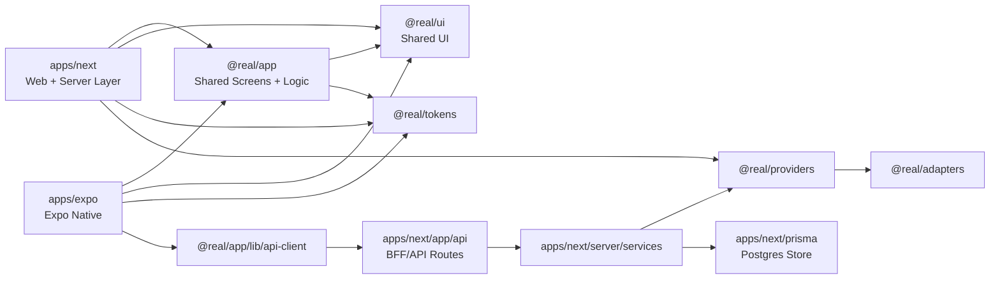
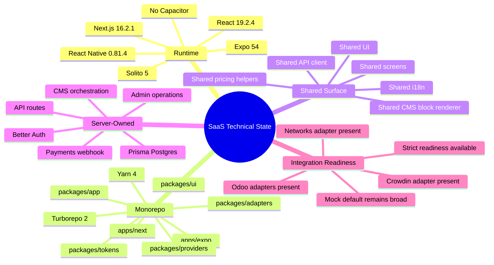
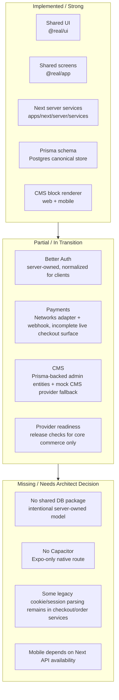

# Technical Status Report

Date: 2026-04-20

## Executive Summary

The repository is a Solito-style universal commerce SaaS codebase with a Next.js web/server app, an Expo mobile app, and shared app/UI/provider/adapter packages. The strongest architectural boundary is the Next server layer: web server components and mobile clients both route data access through `apps/next/app/api` and `apps/next/server/services`. Shared UI and shared screen logic are active, while database persistence, Better Auth, CMS write orchestration, and payment webhooks are currently centralized in the Next app rather than platform-neutral packages.

## Dependency Graph

Main projects:

| Project | Role | Depends On | Notes |
|---|---|---|---|
| `apps/next` | Web app, App Router, API routes, services, Prisma, Better Auth | `@real/app`, `@real/ui`, `@real/tokens`, `@real/providers`, `@real/adapters` | Owns server layer and persistence. `next.config.mjs` aliases `react-native` to `react-native-web`. |
| `apps/expo` | Native iOS/Android app | `@real/app`, `@real/ui`, `@real/tokens` | Uses Expo and React Native; calls Next API through shared `createApiClient`. |
| `packages/app` (`@real/app`) | Shared screens, feature flows, API client, i18n, pricing/referral logic, CMS block renderer | `@real/ui`, `@real/tokens`, `solito`, React Native | Cross-platform UI composition and client-side domain helpers. |
| `packages/ui` (`@real/ui`) | Shared RNR-centered UI components, reusables, primitives, responsive helpers | `@real/tokens`, RN primitives, Uniwind, Moti | Product-facing components and reusable controls. |
| `packages/tokens` (`@real/tokens`) | Design tokens | none | Colors, spacing, typography, radius, motion, component tokens. |
| `packages/providers` (`@real/providers`) | Provider contracts and registry | `@real/adapters` | Selects mock/Odoo/Networks/Crowdin adapters and exports provider instances. |
| `packages/adapters` (`@real/adapters`) | External/mock integration implementations | provider contracts by type import | Mock commerce, Odoo ERP, Networks payments, Crowdin translation. |

## Tech Stack Verification

- Next.js: yes. `apps/next/package.json` pins `next` to `16.2.1`, React to `19.2.4`, and React DOM to `19.2.4`.
- React Native: yes. Both web and native use `react-native` `0.81.4`; web uses `react-native-web` `0.19.13`.
- Solito: yes. `packages/app/package.json` depends on `solito` `^5.0.0`.
- Expo: yes. `apps/expo/package.json` uses `expo` `^54.0.16`; `apps/expo/app.json` targets `ios` and `android`.
- Capacitor: no evidence found. No `@capacitor/*` dependency or Capacitor runtime references were found outside generated/dependency folders.
- Styling/UI system: shared UI uses React Native/RNR primitives, Uniwind/Tailwind token classes for reusables, and tokenized inline styles for product-facing components.
- Database: Prisma `6.5.0` with PostgreSQL datasource in `apps/next/prisma/schema.prisma`.
- Auth: Better Auth `^1.6.2`, wired in `apps/next/lib/auth.ts` through Prisma adapter.

## Shared Logic Audit

| Domain | Current State | Centralized Where | Gap / Risk |
|---|---|---|---|
| Authentication | Partially centralized. Better Auth identity/session lives in Next; normalized auth contracts exist in providers. | `apps/next/lib/auth.ts`, `apps/next/server/services/auth/*`, `packages/providers/contracts/AuthProvider.ts` | The active Better Auth implementation is web/server-owned, not shared in `packages`. Expo calls auth API endpoints through `@real/app/lib/api-client`. Legacy cookie fallback still appears in some checkout/order code paths. |
| Authorization/RBAC | Centralized in Next services/helpers. | `apps/next/app/api/_lib/request-auth.ts`, `apps/next/server/services/auth/auth-role-resolution.service.ts`, Prisma `AppAuthRoleMapping` | App-owned roles are good, but route helper layer still sits under `app/api/_lib`, which is a known boundary-cleanup area. |
| Database | Centralized in Next only. | `apps/next/prisma/schema.prisma`, `apps/next/server/lib/prisma.ts`, `apps/next/server/services/*` | No shared database package. This matches the current architecture: server layer owns data access. |
| Payments | Adapter exists; checkout/payment flow is only partially centralized. | `packages/adapters/payment-networks`, `packages/providers/registry.ts`, `apps/next/server/services/payments/networks-webhook.service.ts` | Networks webhook path is integrated through provider registry. Checkout quote/place-order still mostly uses app services, mock providers, and file-backed mock order persistence; payment initiation is modeled in `OrderProvider` but not fully surfaced as a complete live checkout flow. |
| Product/Catalog | Centralized via providers; release-ready adapter path exists. | `packages/providers/registry.ts`, `packages/adapters/odoo-erp`, `apps/next/server/services/catalog/*` | Mock fallback remains default unless `USE_MOCK=false`; strict readiness can block release-like mock use for product/category/brand/order. |
| CMS | Mixed but moving toward Next + Prisma canonical source. | `apps/next/server/services/cms/*`, `apps/next/server/services/home/home-cms.service.ts`, `packages/app/features/home/*` | CMS provider registry is still marked development-only/mock, while many admin-editable CMS entities are now Prisma-backed through Next services. |
| Pricing/Promotions | Shared pricing engine plus provider-backed quote persistence. | `packages/app/lib/pricing`, `packages/providers/contracts/PromotionProvider.ts`, `apps/next/server/services/checkout/checkout-quote.service.ts` | Core calculations are shared, but quote orchestration and persistence are server-owned. |
| API Client | Shared for web client islands and Expo. | `packages/app/lib/api-client.ts`, `packages/app/lib/endpoints.ts` | Expo depends on the Next API base URL; there is no separate mobile BFF. |
| i18n/RTL | Shared. | `packages/app/lib/i18n/*`, `packages/app/lib/rtl-manager*` | Expo still loads DM Sans font package even though shared token memory says Manrope is canonical for Latin. |

## CMS Integration

There is an existing CMS-to-UI mechanism for both web and mobile:

1. CMS/admin/release data is read and normalized in the Next server layer through `apps/next/server/services/home/home-cms.service.ts`.
2. Blocks are validated with `parseHomeBlock` from `packages/app/lib/cms/blocks.ts`.
3. Disabled release blocks are skipped server-side: `if (blockRecord.enabled === false) continue`.
4. Normalized blocks are emitted as `cmsHome.page.blocks`.
5. The shared `HomeScreen` checks for published blocks and routes to `HomeBlocksRenderer`.
6. `HomeBlocksRenderer` dispatches block `type` values to shared renderers under `packages/app/features/home/renderers`.
7. Web receives this data via server-side `getHomeLayoutData`.
8. Expo receives the same CMS home payload through `apiClient.cms.home()` and renders the same `HomeScreen` from `@real/app`.

Component visibility support:

- Strong support exists for homepage block visibility through release block `enabled` flags.
- Additional CMS-controlled toggles exist across marketing/home fields (`enabled` on rails, complete set, featured slot, brand spotlights, ticker, education banner, offer banners, UGC, newsletter, personalization, checkout payment/fulfillment).
- Shared rendering is strongest for the published-block homepage path. Other CMS-driven shell/checkout/status fields are also consumed by shared screens/layout, but not all of them are represented as formal layout blocks.

## Build Configuration

Monorepo tool:

- Turborepo is installed as `turbo` `^2.4.4`.
- `turbo.json` defines `build` and `test` tasks. `build` depends on upstream builds and outputs `.next/**`; `test` has no declared outputs.
- Package manager is Yarn `4.13.0`.
- Workspaces include `apps/*` and `packages/*`, explicitly excluding `apps/strapi`.

Primary commands:

| Command | Purpose |
|---|---|
| `yarn web` / `yarn web:dev` | Runs Next through `apps/next` `dev:stable`. |
| `yarn web:dev:raw` | Runs `next dev --webpack` directly. |
| `yarn native` / `yarn expo` | Runs Expo start in `apps/expo`. |
| `yarn web:prod` | Builds and starts Next production server. |
| `yarn test` | Runs `turbo run test`; currently anchored by `apps/next` API/service tests. |
| `yarn guard:checks` | Main repo guard suite. |
| `yarn guard:hygiene` | Repo hygiene checks. |
| `yarn guard:agent-docs` | Ensures AGENTS.md remains source of truth. |
| `yarn tsc -p apps/next/tsconfig.json --noEmit --incremental false` | Main TypeScript gate for Next/server/shared compile surface. |
| `yarn --cwd apps/next test:api` | API and server service tests. |
| `yarn --cwd apps/next build --webpack --debug-prerender` | Architecture/build verification for Next request-bound behavior. |

## Implementation State

## Infographic

## Architect Notes

- The architecture is not a Capacitor app. It is Next.js + Expo + Solito-style shared React Native UI.
- The shared UI and screen strategy is real and active; the data plane is intentionally server-owned by Next.
- The project is closer to a commerce platform scaffold with strong mock/provider contracts than to a fully live-integrated SaaS deployment.
- The highest-value architecture follow-ups are:
  1. Complete route/service boundary cleanup so services no longer depend on API-layer helpers.
  2. Finish CMS provider alignment so Prisma-backed CMS is the clear runtime provider, not just service-level overlay.
  3. Decide whether mobile should continue using Next as its API backend or get a versioned public mobile API contract.
  4. Complete payment initiation/confirmation from checkout through the Networks adapter, not only webhook handling.
  5. Remove remaining legacy auth cookie dependencies from checkout/order services in favor of the Better Auth normalized session service.
Play