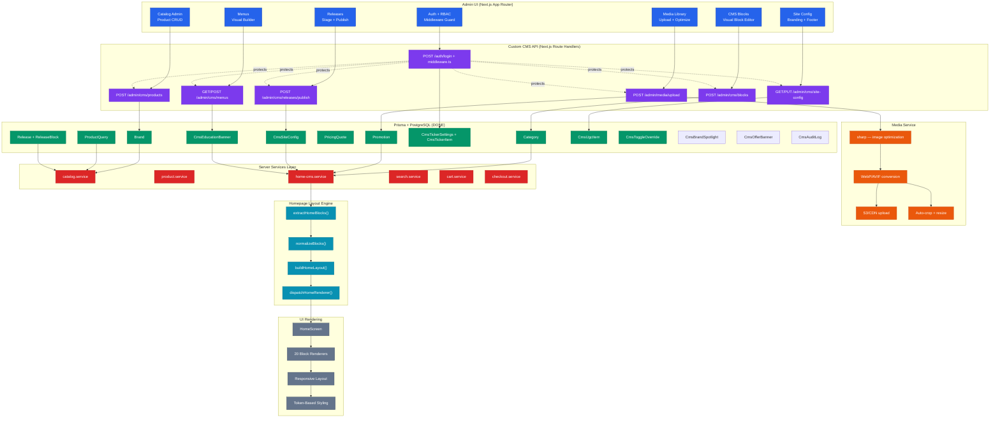
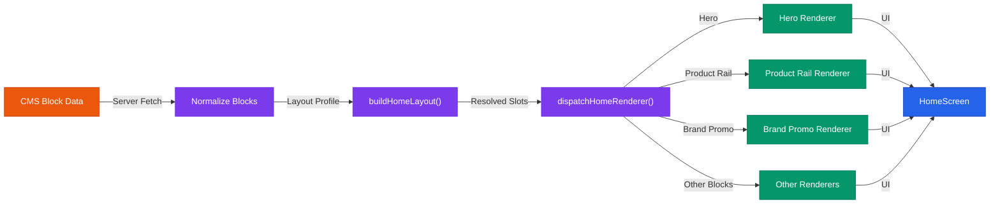
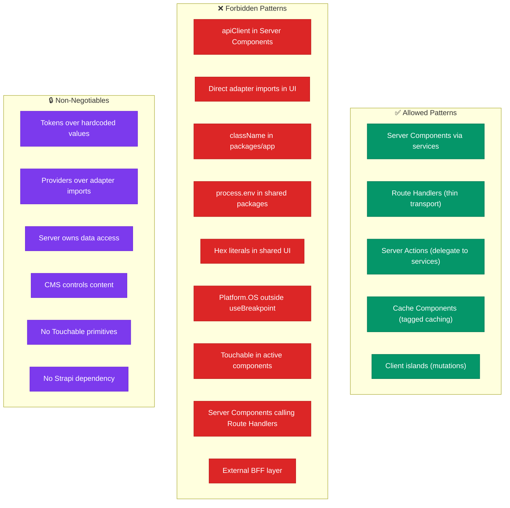
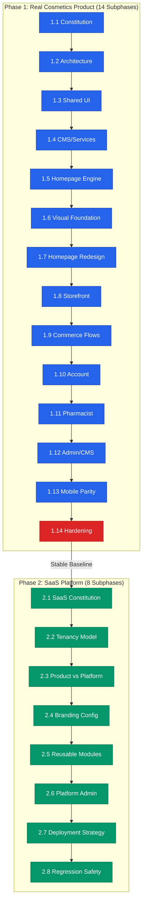
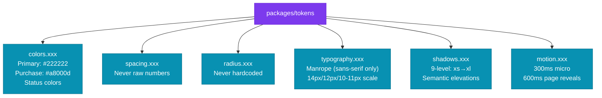

# Solito v5 Architecture Graph

> **Strapi-free.** All CMS, catalog, media, auth, and admin capabilities run within Next.js + Prisma + PostgreSQL.

---

## Current State — Monorepo Structure & Data Flow

```mermaid
graph TB
    subgraph Apps
        Next["apps/next<br/>Next.js 16 Web App + Server Layer"]
        Expo["apps/expo<br/>Expo 54 Mobile App"]
    end

    subgraph Packages
        App["packages/app<br/>Shared Screens & Logic"]
        UI["packages/ui<br/>Shared RNR Component System"]
        Tokens["packages/tokens<br/>Design Tokens"]
        Providers["packages/providers<br/>Contracts + Registry"]
        Adapters["packages/adapters<br/>External Integrations"]
    end

    subgraph UI_Layer["packages/ui Breakdown"]
        Reusables["reusables/<br/>Control Layer (cva + className)"]
        Components["components/<br/>Product-facing UI (inline tokens)"]
        Primitives["primitives/<br/>Legacy (do not grow)"]
        Responsive["responsive/<br/>useBreakpoint()"]
    end

    subgraph Server_Layer["apps/next/server"]
        Services["services/<br/>Business Logic"]
        Routes["Route Handlers<br/>app/api/**"]
        Actions["Server Actions"]
    end

    subgraph Data_Flow
        Admin["Admin UI<br/>/admin/marketing/cms/"]
        CMS["Custom CMS<br/>Route Handlers"]
        Server["Server Layer"]
        Normalized["Normalized Blocks"]
        UI_Render["UI Rendering"]
    end

    subgraph Phase_Plan
        P1["Phase 1: Real Cosmetics Product<br/>14 Subphases"]
        P2["Phase 2: SaaS Platform<br/>8 Subphases"]
    end

    %% Data Flow Connections
    Admin -->|Manage| CMS
    CMS -->|Content| Server
    Server -->|Normalized Blocks| Normalized
    Normalized -->|Layout-as-Data| UI_Render

    %% App Dependencies
    Next -->|Imports| Services
    Next -->|Imports| Providers
    Next -->|Uses| Actions
    Next -->|Uses| Routes

    Expo -->|Uses| App
    Expo -->|Uses| UI
    Expo -->|Uses| Tokens

    App -->|Uses| UI
    App -->|Uses| Providers
    App -->|Uses| Tokens

    UI -->|Uses| Reusables
    UI -->|Uses| Components
    UI -->|Uses| Primitives
    UI -->|Uses| Responsive
    UI -->|Uses| Tokens

    Services -->|Calls| Providers
    Providers -->|Registry| Adapters

    %% Phase Dependencies
    P1 -->|Baseline| P2

    classDef app fill:#2563eb,stroke:#1e40af,color:#fff
    classDef pkg fill:#059669,stroke:#047857,color:#fff
    classDef server fill:#7c3aed,stroke:#6d28d9,color:#fff
    classDef data fill:#ea580c,stroke:#c2410c,color:#fff
    classDef phase fill:#dc2626,stroke:#b91c1c,color:#fff
    classDef ui fill:#0891b2,stroke:#0e7490,color:#fff

    class Next,Expo app
    class App,Providers,Adapters pkg
    class Services,Routes,Actions server
    class Admin,CMS,Server,Normalized,UI_render data
    class P1,P2 phase
    class UI,Reusables,Components,Primitives,Responsive ui
    class Tokens ui
```

---

## Future State — Full CMS Without Strapi

---

## Homepage Layout Engine Pipeline (Unchanged — Keep This)

---

## Architecture Rules (Allowed vs Forbidden)

---

## Strapi Capability Map — What You Build vs What Strapi Provides

```mermaid
graph TB
    subgraph Strapi["What Strapi Would Provide"]
        S1["Content Type Builder"]
        S2["Auto REST/GraphQL API"]
        S3["Media Library + Optimization"]
        S4["RBAC + Auth"]
        S5["i18n System"]
        S6["Drafts + Releases"]
        S7["Admin UI (auto-generated)"]
        S8["Plugin Ecosystem"]
    end

    subgraph Yours["Your Implementation Path"]
        Y1["Zod Schemas + TS Types ✅ Already done"]
        Y2["Custom Route Handlers ✅ Already done"]
        Y3["sharp + S3/CDN — needs building"]
        Y4["Next.js middleware + Prisma users — needs building"]
        Y5["Manual En/Ar fields — improve, keep"]
        Y6["Custom Release System ✅ Already done"]
        Y7["Visual Admin UI — rebuild properly"]
        Y8["Build only what you need"]
    end

    subgraph Replace["What to Replace"]
        R1["JSON files → Prisma + PostgreSQL"]
        R2["Raw fs uploads → sharp + S3"]
        R3["No auth middleware → Add it"]
        R4["JSON-only menus → Visual builders"]
        R5["No caching → ISR + CDN + in-memory"]
    end

    S1 -.->|Already matched| Y1
    S2 -.->|Already matched| Y2
    S3 -.->|Build this| Y3
    S4 -.->|Build this| Y4
    S5 -.->|Keep yours| Y5
    S6 -.->|Already matched| Y6
    S7 -.->|Rebuild this| Y7
    S8 -.->|Skip| Y8

    R1 --> Y2
    R2 --> Y3
    R3 --> Y4
    R4 --> Y7
    R5 --> Y2

    classDef strapi fill:#7c3aed,stroke:#6d28d9,color:#fff
    classDef yours fill:#059669,stroke:#047857,color:#fff
    classDef replace fill:#dc2626,stroke:#b91c1c,color:#fff

    class S1,S2,S3,S4,S5,S6,S7,S8 strapi
    class Y1,Y2,Y3,Y4,Y5,Y6,Y7,Y8 yours
    class R1,R2,R3,R4,R5 replace
```

---

## Build Order — Strapi-Free CMS Completion

```mermaid
graph TB
    subgraph Sprint1["Sprint 1: Foundation (P0 Fixes)"]
        F1["Add Next.js middleware.ts<br/>auth guard for /admin/**"]
        F2["Add Prisma + PostgreSQL<br/>schema for CMS entities"]
        F3["Migrate JSON files → DB<br/>blocks, releases, menus, config"]
        F4["Add CMS caching layer<br/>ISR + in-memory cache"]
    end

    subgraph Sprint2["Sprint 2: Media & Security (P1 Fixes)"]
        F5["Media service: sharp + S3<br/>upload, optimize, WebP, CDN"]
        F6["Add Zod validation<br/>at all route entry points"]
        F7["Add URL validation<br/>href/bannerHref fields"]
        F8["Add input sanitization<br/>XSS protection"]
    end

    subgraph Sprint3["Sprint 3: Admin UX (P1-P2 Fixes)"]
        F9["Split blocks/page.tsx<br/>into sub-components"]
        F10["Build visual menu builder<br/>replace JSON editing"]
        F11["Add drag-and-drop<br/>block ordering with keyboard a11y"]
        F12["Add loading skeletons<br/>error recovery, retry buttons"]
    end

    subgraph Sprint4["Sprint 4: Polish (P2-P3 Fixes)"]
        F13["Add i18n to all admin pages<br/>fix UTF-8 encoding"]
        F14["Add RBAC with Prisma<br/>roles, permissions, audit logs"]
        F15["Parallelize product enrichment<br/>Promise.allSettled"]
        F16["Add rate limiting<br/>public CMS endpoint"]
    end

    F1 --> F2 --> F3 --> F4
    F4 --> F5 --> F6 --> F7 --> F8
    F8 --> F9 --> F10 --> F11 --> F12
    F12 --> F13 --> F14 --> F15 --> F16

    classDef sprint fill:#2563eb,stroke:#1e40af,color:#fff
    classDef s2 fill:#059669,stroke:#047857,color:#fff
    classDef s3 fill:#ea580c,stroke:#c2410c,color:#fff
    classDef s4 fill:#7c3aed,stroke:#6d28d9,color:#fff

    class F1,F2,F3,F4 sprint
    class F5,F6,F7,F8 s2
    class F9,F10,F11,F12 s3
    class F13,F14,F15,F16 s4
```

---

## Phase 1 & 2 Dependency Graph

---

## Token System Hierarchy

---

## What You Already Have vs What You Need to Build

| Capability | Status | Effort |
|---|---|---|
| ✅ Block types + Zod schemas | **Done** — 20 types, discriminated union | — |
| ✅ Layout engine (block → slot → renderer) | **Done** — pure functions, desktop fusion | — |
| ✅ Query reference system | **Done** — block → query → product resolution | — |
| ✅ Release + publish readiness | **Done** — staging, validation, audit trail | — |
| ✅ Admin UI (functional) | **Done** — but needs rebuild for UX quality | Medium |
| ✅ Database (JSON → Prisma) | **Done** — 10 CMS tables, migration script ready | — |
| ✅ Auth middleware | **Done** — middleware.ts guards /admin/** (P0-1) | — |
| 🟡 Media service (sharp + S3) | **Not done** — raw fs uploads don't scale | Medium |
| ✅ CMS caching | **Done** — in-memory LRU cache, 3-min TTL, preview bypass (P0-2) | — |
| 🟡 Input sanitization | **Not done** — XSS risk on text fields | Low |
| 🟡 URL validation | **Not done** — accepts any string | Low |
| 🟡 Visual menu builder | **Not done** — JSON-only editing is poor UX | High |
| 🟡 RBAC with Prisma | **Not done** — basic session check only | Medium |
| 🟡 i18n on admin pages | **Not done** — hardcoded English | Low |
| 🟡 Rate limiting | **Not done** — public endpoint unprotected | Low |

**Total: 3 P0s + P1 done, 5 things to build, 15 things that already exist.** None of them require Strapi.

---

## P0 Fixes Applied — 2026-04-09

### P0-1: Auth Middleware Activated

**Problem:** `proxy.ts` contained solid auth logic (signed HMAC cookies, RBAC matrix, trusted request checks) but was named wrong — Next.js expects `middleware.ts`. Admin pages were unprotected at the edge.

**Fix:** Copied `proxy.ts` → `middleware.ts`. Next.js now executes the auth guard on every request:
- `/admin/**` → requires valid session cookie + admin panel role
- Unauthenticated → redirect to `/auth/login`
- Wrong role → redirect to `/`
- Pharmacist/customer routes → role-based routing

**Files changed:** `apps/next/middleware.ts` (new)

### P0-2: CMS Caching Layer Added

**Problem:** `getHomeCmsResponseData()` (~350 lines) hit all providers and all FS stores on every single request with zero caching. Every SSR page load = 5+ provider calls + 5 `fs.readFile` calls.

**Fix:** Three-layer caching:
1. **In-memory LRU cache** (`cms-cache.ts`) — 50 entries, 5-min TTL, tag-based invalidation
2. **Cached entry point** (`getCachedHomeCmsResponseData`) — wraps the existing function with cache read/write, preview bypass
3. **All callers updated** — home-page, search, product, orders, pharmacist services all use cached version

**Cache behavior:**
- Non-preview requests: cached by `locale:storeId:environment`, 3-minute TTL
- Preview requests: always bypass cache
- On publish: `invalidateCmsCache()` flushes related entries

**Files changed:**
- `apps/next/server/services/home/cms-cache.ts` (new)
- `apps/next/server/services/home/home-cms.service.ts` (added cached entry point)
- `apps/next/server/services/home/home-page.service.ts` (use cached)
- `apps/next/server/services/search/search.service.ts` (use cached)
- `apps/next/server/services/product/product-page.service.ts` (use cached)
- `apps/next/server/services/orders/order-detail.service.ts` (use cached)
- `apps/next/server/services/pharmacist/pharmacist-bootstrap.service.ts` (use cached)

### P1: JSON Stores → Prisma + PostgreSQL

**Problem:** All CMS data (banners, UGC, site config, admin controls, audit logs) stored in JSON files on disk. No concurrent write safety, no transactions, no queries, no scaling.

**Fix:** Extended existing Prisma schema with 10 new CMS tables:
- `CmsSiteConfig` — site-wide branding, top bar, footer, search config (singleton)
- `CmsTickerSettings` — ticker speed (singleton)
- `CmsTickerItem` — scrolling ticker messages
- `CmsEducationBanner` — education banners
- `CmsUgcItem` — user-generated content gallery
- `CmsToggleOverride` — admin toggle overrides
- `CmsBrandSpotlight` — brand spotlight blocks (JSON payload)
- `CmsOfferBanner` — offer banner blocks (JSON payload)
- `CmsAuditLog` — admin operation audit trail

Updated 4 store modules to use Prisma:
- `admin-banners-store.ts` — reads 3 tables in parallel, writes via transaction
- `admin-ugc-store.ts` — reads/writes `CmsUgcItem` table
- `admin-site-config-store.ts` — reads/writes `CmsSiteConfig` singleton
- `admin-controls-store.ts` — reads 4 tables in parallel, writes toggles/spotlights/banners/audits via transaction

**Migration:** `apps/next/scripts/migrate-cms-data.ts` — safe, idempotent script to transfer JSON → DB. Run after `npx prisma migrate deploy`.

**Remaining JSON files:** User overrides (part of identity system, future migration), page-version store (complex release system, future migration).

**Files changed:**
- `apps/next/prisma/schema.prisma` (10 new models)
- `apps/next/prisma/migrations/20260409000000_cms_entities_replace_json_stores/migration.sql` (new)
- `apps/next/server/lib/prisma.ts` (new — Prisma singleton)
- `apps/next/app/api/_lib/admin-banners-store.ts` (use Prisma)
- `apps/next/app/api/_lib/admin-ugc-store.ts` (use Prisma)
- `apps/next/app/api/_lib/admin-site-config-store.ts` (use Prisma)
- `apps/next/app/api/_lib/admin-controls-store.ts` (use Prisma)
- `apps/next/scripts/migrate-cms-data.ts` (new — data migration script)

---

*Generated: 2026-04-09 | Sources: QWEN.md, AGENTS.md, plan.md, requirements.md, CMS audit*
*P0s fixed: Auth + Caching + Prisma CMS storage. Next: Media service (sharp + S3) or UX polish.*
